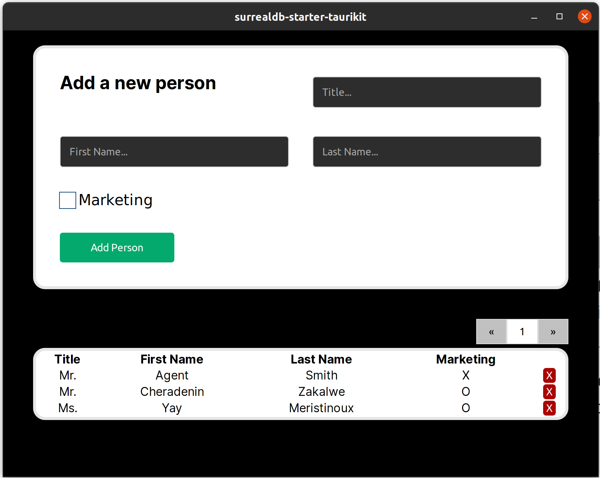

# Starter Kit for SurrealDB + Tauri + Next.js

This starter kit provides a streamlined setup for developing a [Tauri App](https://tauri.app/) + [Next.js](https://nextjs.org/) applications with an integrated [SurrealDB](https://surrealdb.com/) database. It bridges the frontend with the backend using an ICP command layer following the JSON-RPC 2.0 format.



## Features

- Tauri Backend: Set up a backend using Tauri, a framework to build desktop applications with any frontend framework and a Rust core.

- Next.js Frontend: Create dynamic and responsive user interfaces with Next.js, a popular React framework.

- JSON-RPC 2.0 Communication: Seamless communication between frontend and backend using JSON-RPC 2.0 protocol.

- SurrealDB Integration: Easily connect your backend with SurrealDB, a multi-model database that makes building and scaling realtime apps dramatically quicker and easier.

## Prerequisites:

- Be sure to have [Rust and Cargo](https://www.rust-lang.org/tools/install) installed.

- Please refer to the prerequisites for using [Tauri](https://tauri.app/v1/guides/getting-started/prerequisites/).

- To use the Tauri CLI from source (bleeding edge version) you need to install it via:

```bash
cargo install --git https://github.com/tauri-apps/tauri --branch 1.x tauri-cli
```

- [Node.js](https://nodejs.org/en/download) > v18

## Getting Started

1. Clone the Repository:

```bash
git clone git@github.com:reymom/surrealdb-starter-taurikit.git
```

2. Backend Setup

- Navigate to the backend directory `src-tauri`.
- Follow the [README](https://github.com/reymom/surrealdb-starter-taurikit/tree/develop/src-tauri#main-commands) to (1) build the rust application and (2) **generate the frontend bindings**.
- To an overview on where to create and customize your types and method implementations, refer to the backend [README](https://github.com/reymom/surrealdb-starter-taurikit/tree/develop/src-tauri#development-overview).

3. Frontend Setup

- In the main directory, install the dependencies:

```bash
npm install
```

- Run the Tauri - Next.js development server:

```
cargo tauri dev
```

## Persistent storage

> Note: SurrealDB is run as an in-memory database. To enable persitent storage, edit the `src-tauri/Cargo.toml` to enable all `surrealdb` features.

> Refer to [src-tauri/Readme.md](https://github.com/reymom/surrealdb-starter-taurikit/tree/develop/src-tauri#persistent-storage) for further information.

## Contributing

If you find any issues or have suggestions for improvements, please feel free to open an issue or create a pull request.

Happy coding!
